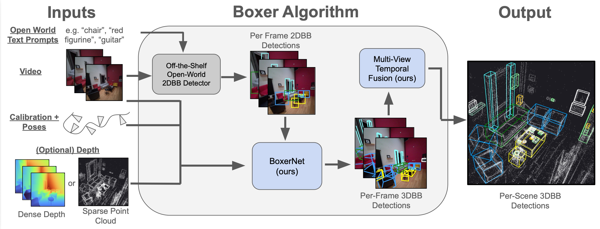
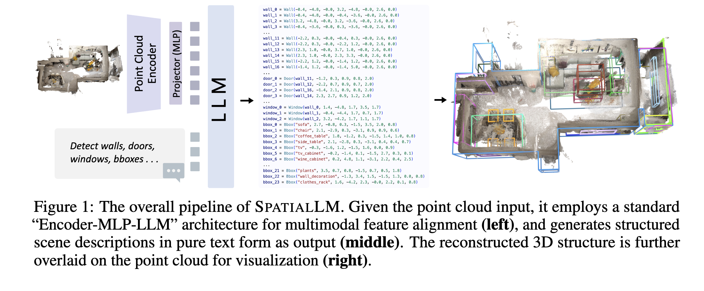

# 3D Scene Understanding — Index

Research on parsing 3D environments — from point clouds, RGBD scans, or video — into structured representations of layout, objects, and spatial relationships. Covers both classical geometry-based methods and LLM-based approaches for indoor scene reconstruction, object detection, and spatial reasoning.

## Papers by year

### 2026
- [[papers/2026-boxer-lifting-2d-to-3d|Boxer: Robust Lifting of Open-World 2D Bounding Boxes to 3D]] — Open-vocabulary 3D object detection via 2D lift: OWLv2 finds objects from text prompts, BoxerNet predicts full 3D OBBs using camera intrinsics and depth, fusion across frames for scene consistency

### 2025
- [[papers/2025-spatiallm-structured-indoor-modeling|SpatialLM: Training LLMs for Structured Indoor Modeling]] — Encoder-MLP-LLM pipeline that processes point clouds and outputs structured text descriptions of indoor scenes (layout + 3D objects); NeurIPS 2025 SOTA on Structured3D and ScanNet

## Concepts

- [[concepts/open-world-detection|Open-World Detection]] — open-vocabulary object detection from arbitrary text/visual prompts without fixed category constraints; enables zero-shot generalization
- [[concepts/3d-bounding-box|3D Bounding Box]] — oriented or axis-aligned boxes in 3D space parameterized by center, dimensions, and rotation; representation for object geometry
- [[concepts/multi-view-fusion|Multi-View Fusion]] — merging per-frame detections across video or multi-camera rigs via Hungarian matching or online tracking for globally consistent scene-level representations
- [[concepts/structured-scene-representation|Structured Scene Representation]] — encoding 3D scenes as typed parameterised elements; text-as-structure format enabling LLM compatibility and editability
- [[concepts/point-cloud-encoding|Point Cloud Encoding]] — voxelisation, FPS, and DINOv2 feature lifting for mapping raw 3D points into LLM token space; ablation findings on resolution and encoder design

## See also

- [[../vision-language-models/index|Vision-Language Models]] — related: 2D region understanding and localized captioning; overlaps in multimodal LLM architecture patterns
