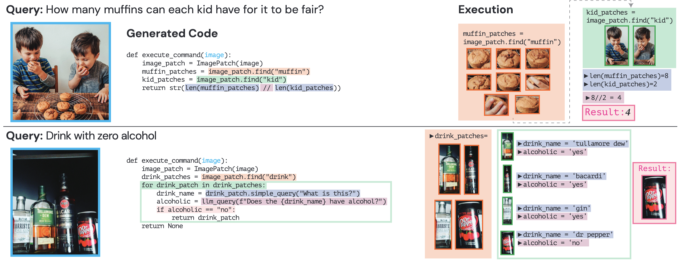

# Agentic Multimodal LLMs — Index

Research on large language models that act as agents over multimodal inputs (images, video, text) and outputs, combining vision understanding with reasoning, tool use, and program synthesis. Emphasis on zero-shot compositional generalization, interpretability, and the role of code generation in bridging neural perception and symbolic reasoning.

## Papers by year

### 2025
- [[papers/2025-tooleqa-embodied-question-answering|ToolEQA: Multi-Step Reasoning for Embodied Question Answering via Tool Augmentation]] — integrates external tools with multi-step reasoning for embodied QA, decomposes questions into plans and tool invocations; 9.2–20.2% improvement over baselines with shorter exploration paths

- [[papers/2025-vipact-visual-perception-agent|VipAct: Visual-Perception Enhancement via Specialized VLM Agent Collaboration and Tool-use]] — multi-agent VLM framework with orchestrator, specialized agents, and vision experts for fine-grained visual perception; systematic collaboration overcomes VLM pixel-level limitations

### 2024
- [[papers/2024-llm-as-tool-makers|Large Language Models as Tool Makers]] — closed-loop framework where LLMs generate reusable Python tools from examples, enabling cost-efficient problem-solving via division of labor between expensive tool-maker and cheap tool-user models

### 2023
- [[papers/2023-viper-gpt|ViperGPT: Visual Inference via Python Execution for Reasoning]] — leverages GPT-3 Codex to generate executable Python programs that compose vision modules for complex visual reasoning; SOTA zero-shot on grounding, image QA, video QA via compositional interpretability

### 2022
- [[papers/2022-visual-programming-compositional-visual-reasoning|Visual Programming: Compositional visual reasoning without training]] — neuro-symbolic approach using GPT-3 in-context learning to generate Python programs composing vision/language modules; handles long-tail tasks (VQA, NLVR, knowledge tagging, image editing) without task-specific training

## Concepts

- [[concepts/program-synthesis-for-vision|Program Synthesis for Vision]] — automatic generation of executable code (Python) that composes vision primitives; code priors from LLM training enable flexible composition without task-specific learning
- [[concepts/modular-composition|Modular Composition]] — decomposing visual reasoning tasks into chains of reusable vision operations (detection, property verification, spatial reasoning, depth estimation); improvements in any module directly improve downstream performance
- [[concepts/code-generation-llms|Code-Generation LLMs]] — large language models trained on code (e.g., GPT-3 Codex) that can generate executable programs; leverage learned priors about logical composition, control flow, and API usage
- [[concepts/zero-shot-visual-reasoning|Zero-Shot Visual Reasoning]] — solving novel visual tasks without task-specific training by synthesizing new program compositions via LLM; generalization achieved through combinatorial reuse of pretrained modules

## See also

- [[../vision-language-models/index|Vision-Language Models]] — related: shared use of vision-language composition, but agentic approaches emphasize explicit reasoning and program structure
- [[../video-understanding/index|Video Understanding]] — overlaps in temporal reasoning and video QA; agentic approaches provide interpretable step-by-step grounding over time
