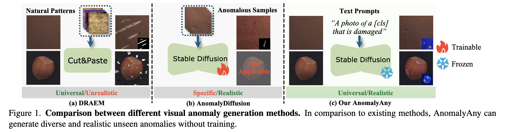
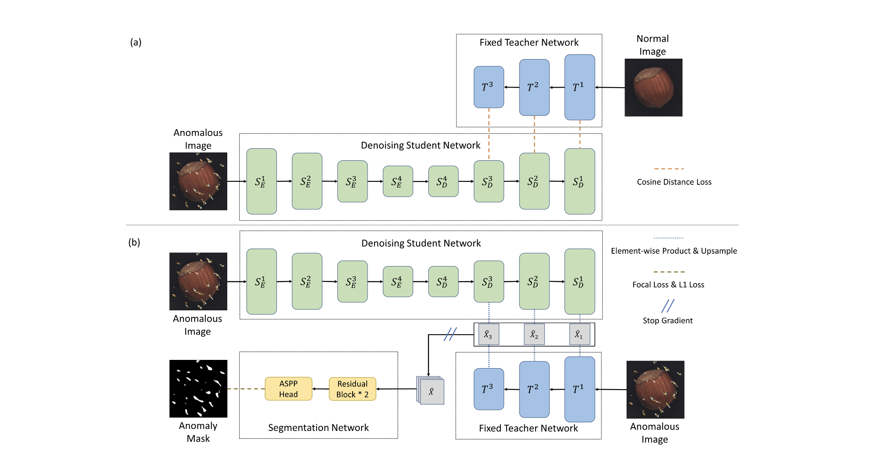
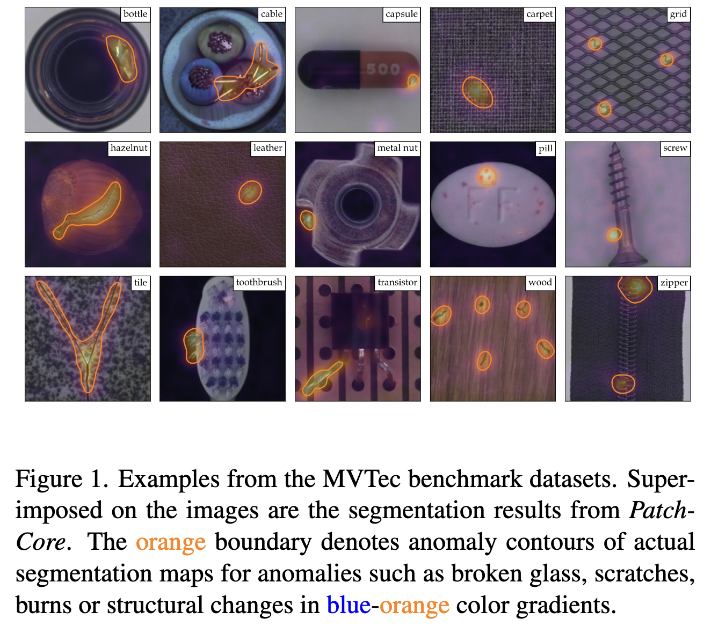
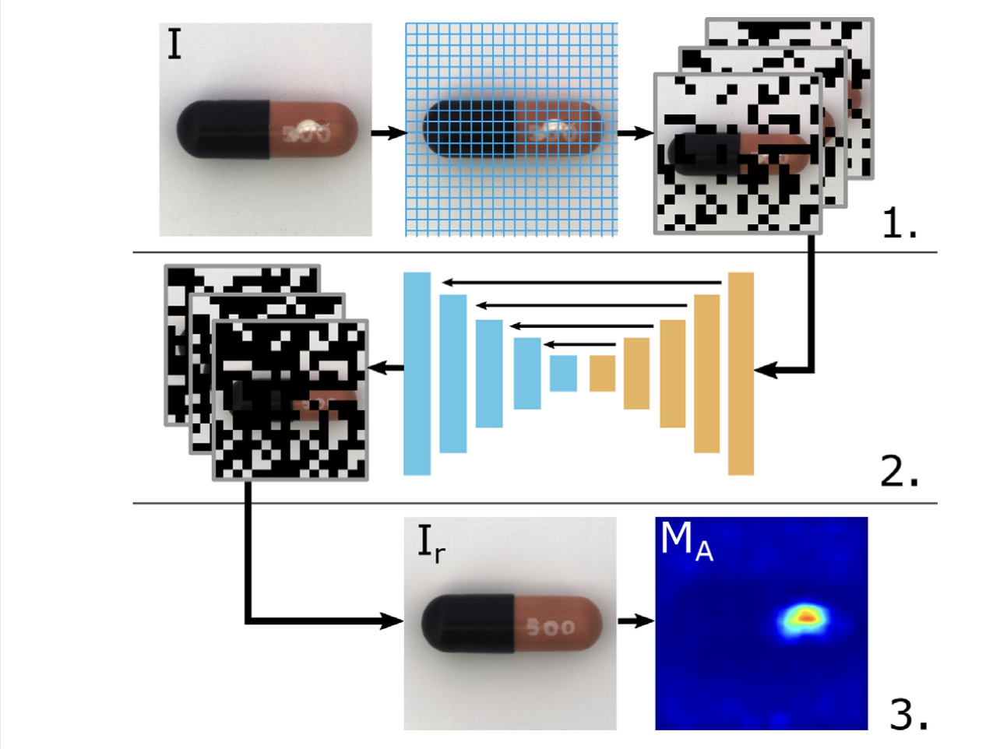

# Anomaly Detection — Index

Research on detecting anomalous patterns in visual data — covering visual anomaly detection in industrial inspection, change detection in natural scenes and earth observation, and related localization and segmentation tasks. Emphasis on handling data scarcity, generalization to unseen domains, and zero-shot capabilities.

## Papers by year

### 2025
- [[papers/2025-unseen-visual-anomaly-generation|Unseen Visual Anomaly Generation (AnomalyAny)]] — uses Stable Diffusion with test-time conditioning to generate diverse, realistic unseen anomalies from single normal sample; attention-guided optimization and prompt-guided refinement; enhances downstream anomaly detection without training

### 2023
- [[papers/2023-destseg-anomaly-detection|DeSTSeg: Segmentation Guided Denoising Student-Teacher for Anomaly Detection]] — student-teacher framework with denoising student encoder-decoder; synthetic anomaly training; adaptive feature fusion via segmentation network; 98.6% image-level AUC on MVTec AD

### 2021
- [[papers/2021-patchcore|Towards Total Recall in Industrial Anomaly Detection (PatchCore)]] — patch-level memory bank with locally-aware feature aggregation; greedy coreset subsampling for efficiency; 99.6% AUROC on MVTec AD, halving prior error; strong spatial localization

- [[papers/2021-reconstruction-by-inpainting-anomaly-detection|Reconstruction by inpainting for visual anomaly detection (RIAD)]] — self-supervised inpainting-based anomaly detection; masks image regions and reconstructs from neighborhood only; avoids auto-encoder over-generalization; achieves SOTA on MVTec AD

## Concepts

- [[concepts/visual-anomaly-detection|Visual Anomaly Detection]] — identifying unusual/unexpected patterns in images; one-class classification and segmentation; challenges in data scarcity and zero-shot scenarios
- [[concepts/synthetic-anomaly-generation|Synthetic Anomaly Generation]] — creating realistic anomalous samples for training without real anomaly data; diffusion models, cut-and-paste, texture synthesis approaches
- [[concepts/zero-shot-anomaly-detection|Zero-Shot Anomaly Detection]] — detecting anomalies without task-specific training; foundation model approaches; generalization to unseen objects and domains
- [[concepts/student-teacher-framework|Student-Teacher Framework]] — knowledge distillation approach for anomaly detection; training student to mimic teacher features on normal data; detecting anomalies via feature discrepancy

## See also

- [[../change-detection/index|Change Detection]] — related temporal anomaly task; now in separate topic
- [[../vision-language-models/index|Vision-Language Models]] — foundation models (SAM, CLIP) used in anomaly detection; open-vocabulary approaches leverage VLMs
