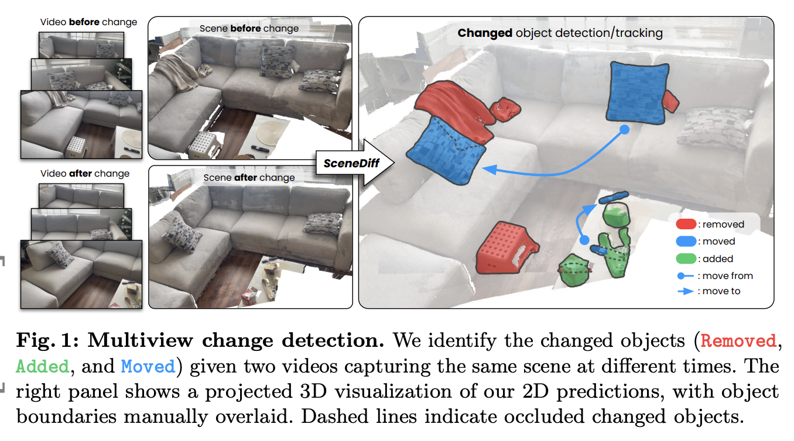
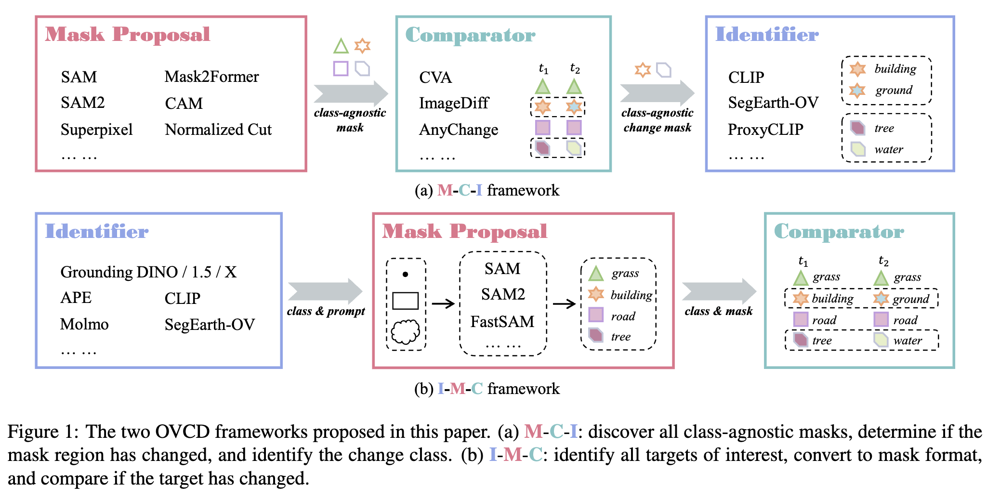
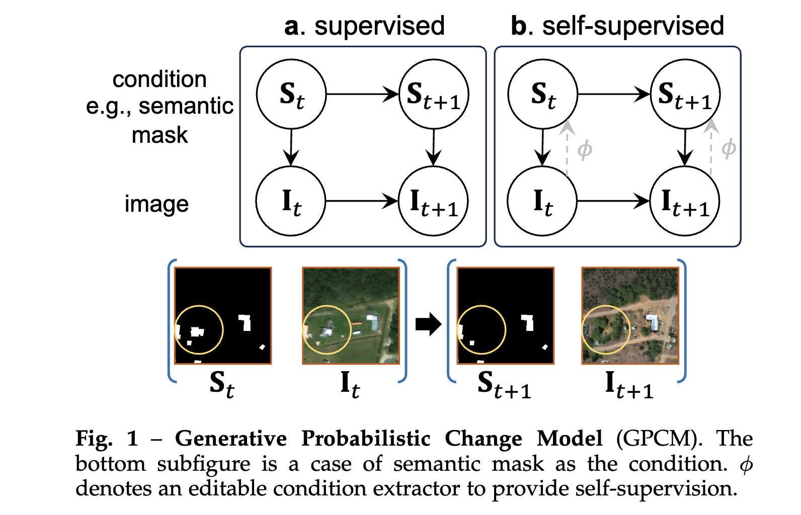
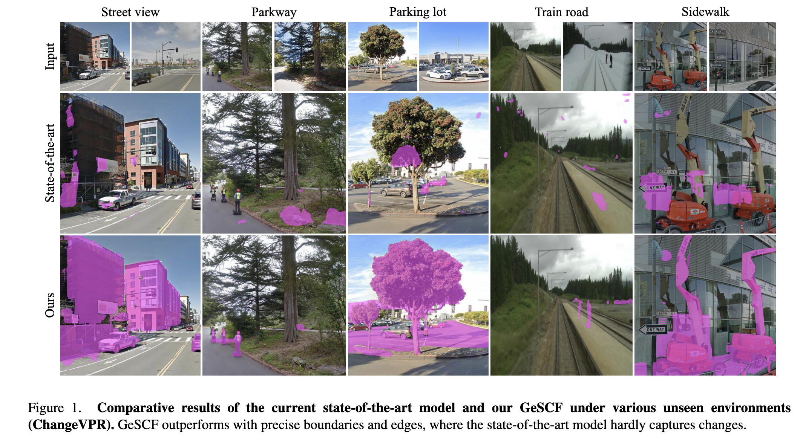

# Change Detection — Index

Research on detecting and localizing temporal changes between image pairs or sequences — spanning earth observation satellite imagery, natural scene photography, surveillance, and robotics. Emphasis on domain generalization, open-vocabulary semantic understanding, and zero-shot adaptation of foundation models.

## Papers by year

### 2026
- [[papers/2026-scenediff-multiview-object-change-detection|SceneDiff: A Benchmark and Method for Multiview Object Change Detection]] — instance-level change detection in multiview scenes; aligns before/after video sequences using 3D geometry of static elements; training-free pipeline combines π³, SAM, DINO for added/removed/moved object classification; 350-pair benchmark with dense annotations

### 2025
- [[papers/2025-dynamicearth-open-vocabulary-change-detection|DynamicEarth: How Far are We from Open-Vocabulary Change Detection?]] — addresses "4W" queries in earth observation; combines SAM, SAM2, CLIP for open-vocabulary change detection; Mask-Compare-Identify framework leverages foundation models for semantic change understanding

### 2024
- [[papers/2024-changen2|Changen2: Multi-Temporal Remote Sensing Generative Change Foundation Model]] — synthetic change data generation via generative probabilistic change model (GPCM) and resolution-scalable diffusion transformer; self-supervised pretraining on unlabeled satellite imagery; zero-shot performance within 3-10% of supervised models; first remote sensing foundation model with change detection capability

- [[papers/2024-towards-generalizable-scene-change-detection|Towards Generalizable Scene Change Detection (GeSCF)]] — zero-shot scene change detection using SAM with domain generalization; addresses temporal consistency and unseen environment robustness; introduces ChangeVPR dataset and GeSCD benchmark; 19.2% improvement on existing datasets

## Concepts

- [[concepts/change-detection|Change Detection]] — identifying and localizing temporal differences between image pairs; applications in earth observation, surveillance, robotics; domain shift and generalization challenges
- [[concepts/zero-shot-change-detection|Zero-Shot Change Detection]] — detecting changes without task-specific training; foundation model adaptation and prompt-based approaches
- [[concepts/open-vocabulary-change-detection|Open-Vocabulary Change Detection]] — describing changes in natural language rather than predefined categories; enables semantic understanding and user queries

## See also

- [[../anomaly-detection/index|Anomaly Detection]] — related task; change detection is a type of temporal anomaly; both leverage foundation models
- [[../vision-language-models/index|Vision-Language Models]] — foundation models (SAM, CLIP) are core to change detection approaches
