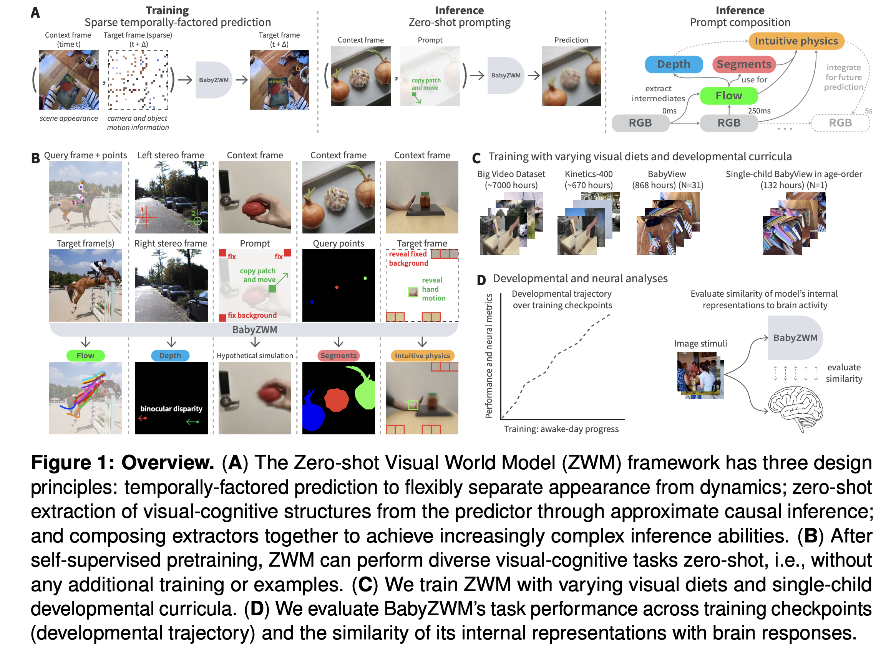
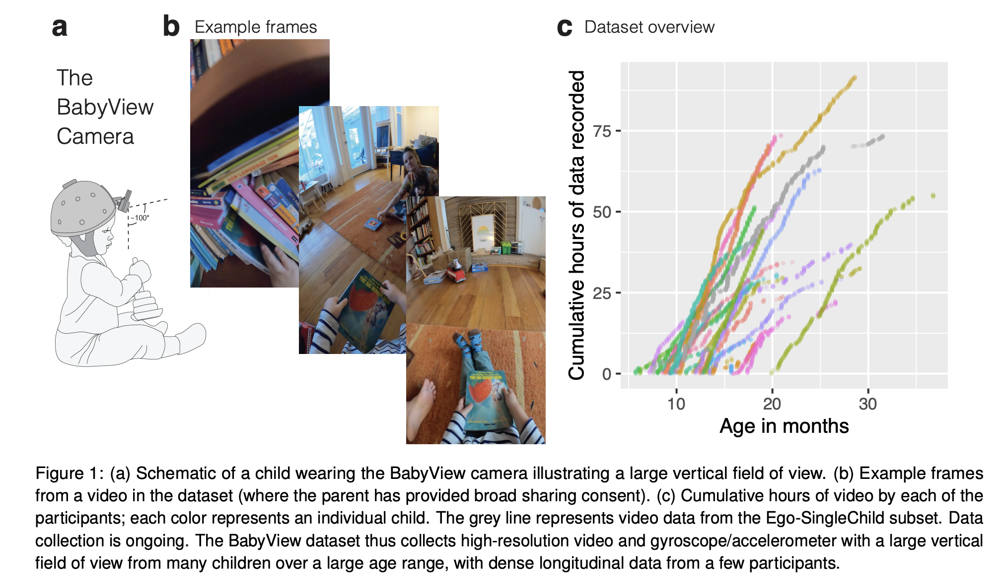

# Cognitive AI — Index

Research bridging cognitive science and artificial intelligence. Focuses on understanding how human cognition and learning—especially in early childhood development—can inform AI system design, and conversely, how AI can illuminate mechanisms of human learning. Covers developmental datasets, models of cognitive abilities, learning from limited data, neural-behavioral alignment, and comparative studies of human-AI cognition.

## Papers by year

### 2026
- [[papers/2026-babyzwm-zero-shot-world-models|Zero-shot World Models Are Developmentally Efficient Learners]] — demonstrates cognitive-AI methodology: architecture grounded in developmental principles; learns from 868 hours of child egocentric video; developmental trajectory and brain-aligned representations

### 2025
- [[papers/2025-babyview-egocentric-video-dataset|The BabyView dataset: High-resolution egocentric videos of infants' and young children's everyday experiences]] — largest developmental egocentric video dataset (868 hours, 31 families, ages 6 months–3 years); quantifies data gap between human and AI learning efficiency; foundational resource for bridging cognitive science and AI

## Concepts

- [[concepts/data-gap|Data Gap]] — the efficiency gap between human and machine learners; humans achieve high performance with orders of magnitude less training data than current AI systems
- [[concepts/egocentric-learning|Egocentric Learning]] — learning from first-person perspective; provides window into natural sensory input and embodied experience during development
- [[concepts/developmental-alignment|Developmental Alignment]] — alignment of AI model behavior, learning trajectories, and internal representations with documented patterns of human child development

## See also

- [[../world-models/index|World Models]] — related: computational approaches to learning representations of visual dynamics and physical reasoning. Cognitive-AI and World-Models overlap (e.g., BabyZWM appears in both topics); cognitive-ai emphasizes developmental plausibility and human-scale data efficiency
- [[../vision-language-models/index|Vision-Language Models]] — related: large-scale multimodal models; cognitive-ai focuses on small-scale, human-like learning from naturalistic data

