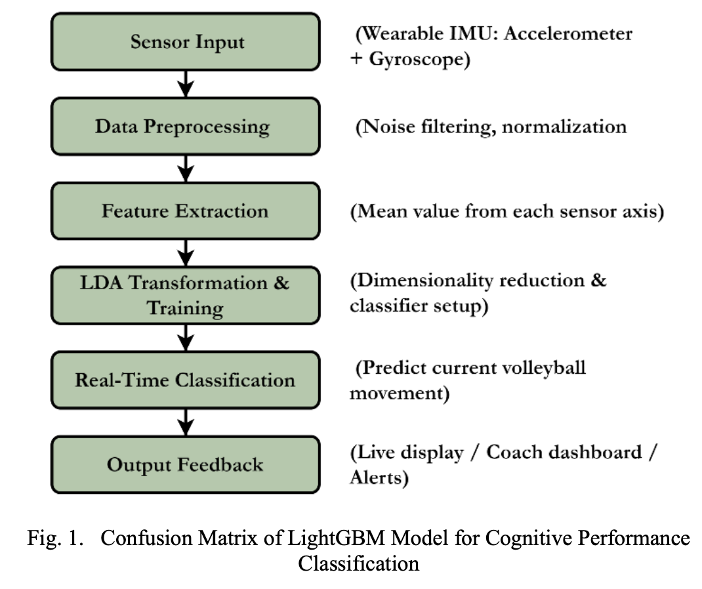
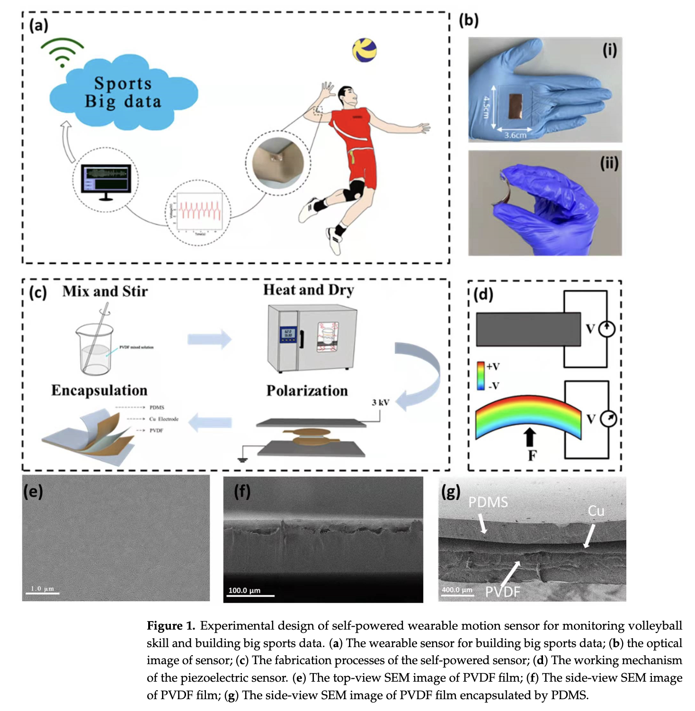
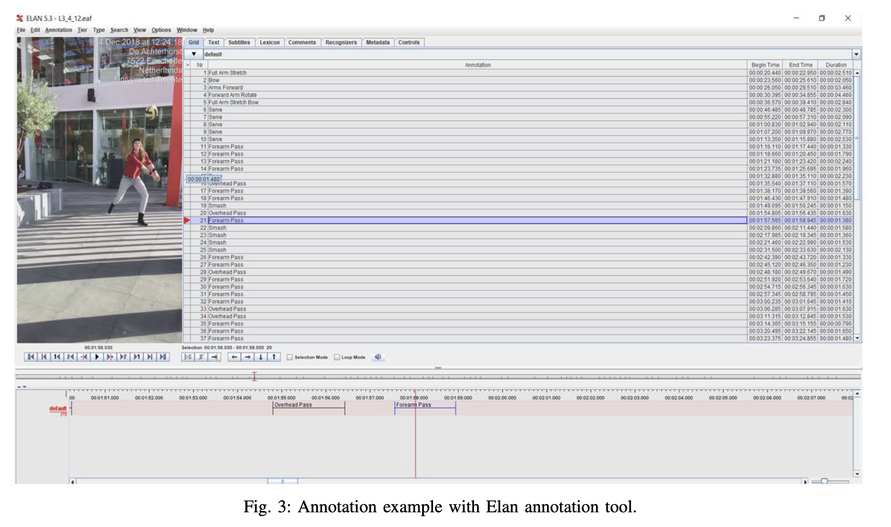

# Sports Analytics — Index

Research applying machine learning and sensor technology to athlete performance analysis, movement classification, injury prevention, and coaching feedback. Covers both classical ML and deep learning approaches across wearable sensor and video modalities.

## Papers by year

### 2025
- [[papers/2025-realtime-volleyball-movement-classification-lda|Real-Time Volleyball Movement Classification using LDA]] — LDA on 6-DoF IMU sensor data for 6-class volleyball action recognition; 99.09% accuracy; real-time embedded deployment focus

### 2022
- [[papers/2022-self-powered-wearable-motion-sensor-volleyball|Self-Powered Wearable Motion Sensor for Monitoring Volleyball Skill and Building Big Sports Data]] — piezoelectric PVDF film sensor for detecting spiking motion; energy-harvesting approach eliminates battery dependency; real-time skill monitoring with integrated physiological sensing

### 2019
- [[papers/2019-volleyball-action-modelling-imu-feedback|Volleyball Action Modelling for Behavior Analysis and Interactive Multi-modal Feedback]] — dual-wrist IMU with 5 classifiers; explores sensor fusion and hand placement; auto-tagging system prototype with web frontend; 86.9% UAR (Acc+Mag, both hands)

## Concepts

- [[concepts/linear-discriminant-analysis|Linear Discriminant Analysis (LDA)]] — supervised dimensionality reduction + classification; maximises between-class vs within-class scatter; low-latency, interpretable, suitable for small datasets
- [[concepts/imu-wearable-sensors|IMU Wearable Sensors]] — 6-DoF inertial sensors for athlete motion capture; advantages over video; feature extraction conventions
- [[concepts/piezoelectric-sensors|Piezoelectric Sensors]] — mechanical deformation to electrical voltage; energy-harvesting modality; flexible polymer variants (PVDF) for wearables
- [[concepts/energy-harvesting-wearables|Energy Harvesting Wearables]] — self-powered sensors that extract power from body motion or environment; eliminates battery maintenance for continuous monitoring

## See also

*(Links to related topic wikis will appear here as they are created)*
