# Video Understanding — Index

Research on training models to understand, reason about, and answer questions over video content — covering temporal grounding, long-form video QA, and adaptive frame retrieval. Emphasis on how reinforcement learning and dynamic search strategies are replacing static frame sampling as the dominant paradigm.

## Papers by year

### 2019
- [[papers/2019-slowfast-networks|SlowFast Networks for Video Recognition]] — ICCV; dual-pathway architecture separating spatial (Slow, low frame rate) and temporal (Fast, high frame rate) processing; biologically inspired (P-cells vs. M-cells); lightweight Fast pathway (~20% computation); SOTA on Kinetics, Charades, AVA
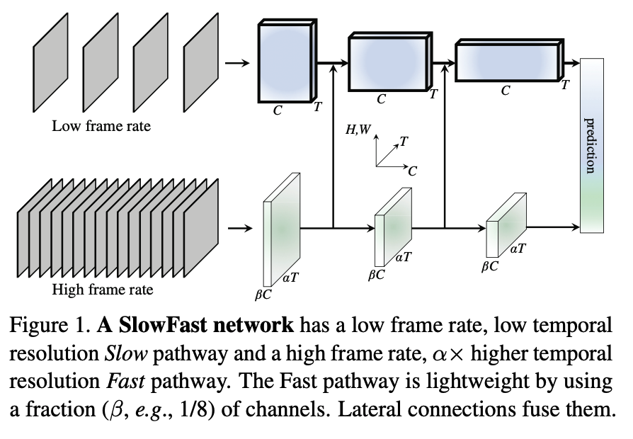

### 2024
- [[papers/2024-videochat|VideoChat: Chat-Centric Video Understanding]] — arXiv; first chat-centric video-LLM unifying video understanding as multi-round QA; VideoChat-Text (textual descriptions) + VideoChat-Embed (direct embeddings); video-centric instruction dataset with ChatGPT-generated conversations; excels at spatiotemporal reasoning and causal inference
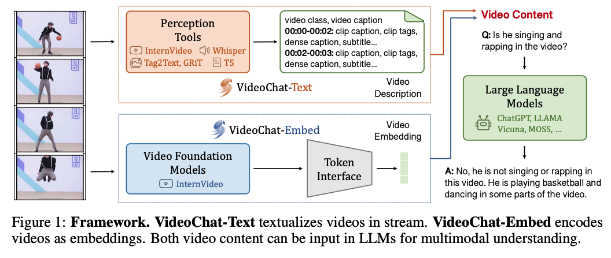

- [[papers/2024-vrag-retrieval-augmented-video-qa|VRAG: Retrieval-Augmented Video Question Answering for Long-Form Videos]] — CVPR Workshop; retrieval-first RAG approach for long-form VideoQA using multimodal search (semantic, audio, OCR, objects) + temporal re-ranking; 40.5/45 on KIS, 4/5 on VQA queries (VBS benchmark)
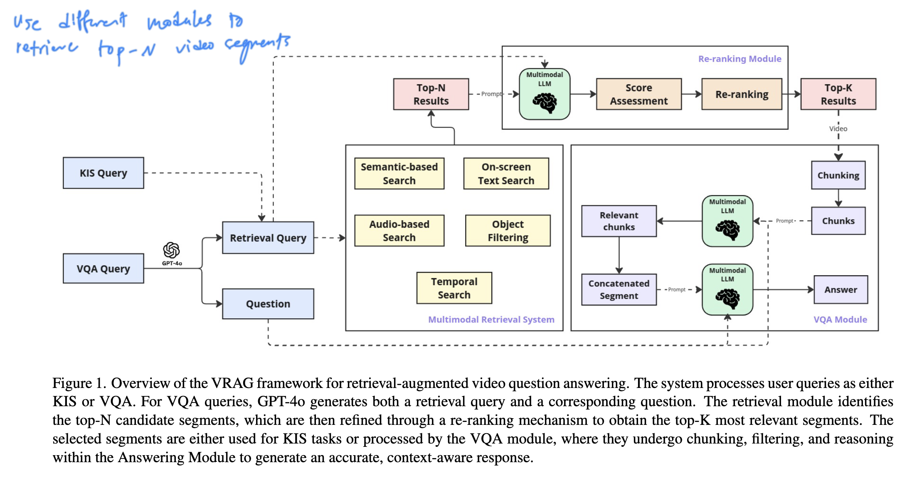

### 2026
- [[papers/2026-video-understanding-large-language-models-survey|Video Understanding With Large Language Models: A Survey]] — IEEE TCSVT; comprehensive taxonomy of 3 architectures (Analyzer×LLM, Embedder×LLM, hybrid) and 5 LLM functional roles (Summarizer, Manager, Text Decoder, Regressor, Hidden Layer); covers 100+ Vid-LLMs, benchmarks, evaluation methods, and applications
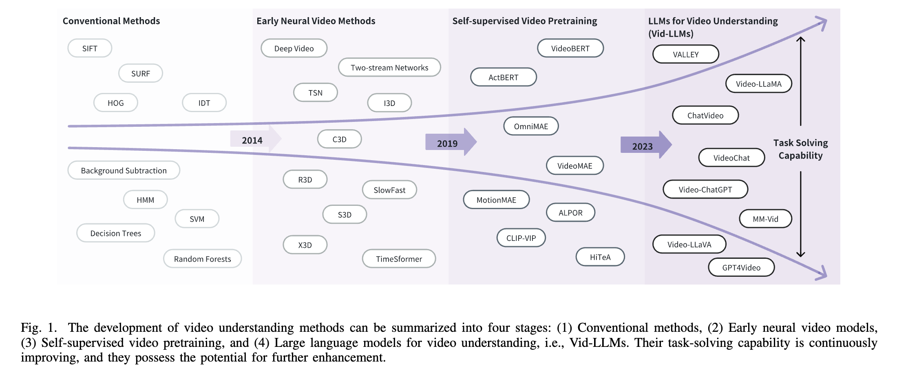

- [[papers/2026-videoweave|VideoWeave: A Data-Centric Approach for Efficient Video Understanding]] — splices short captioned videos into synthetic long-context training samples; shows compute-efficient improvements in downstream video QA via data composition without architecture changes
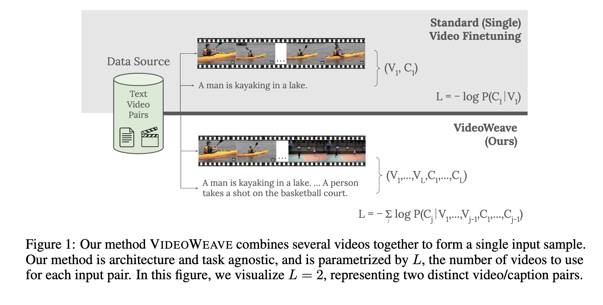

### 2025
- [[papers/2025-agentic-keyframe-search|Agentic Keyframe Search for Video Question Answering]] — arXiv; language agent-guided A* search on dynamic video trees for keyframe selection; achieves 63.1% on EgoSchema (+2%) and 77.4% on NExT-QA (+1.8%) while processing only 43.5% of frames vs VideoTree
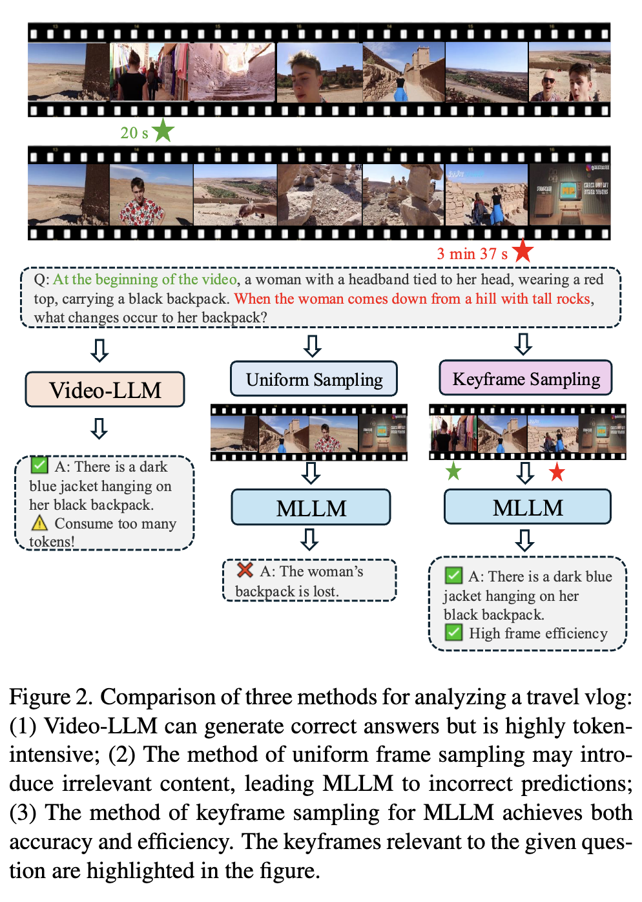

- [[papers/2025-keyframe-oriented-vision-token-pruning|Keyframe-oriented Vision Token Pruning (KVTP)]] — arXiv; combines keyframe selection with adaptive vision token pruning via query-aware frame relevance prediction; achieves 80% token reduction without performance loss; introduces SparseKV-QA benchmark for sparse key information scenarios
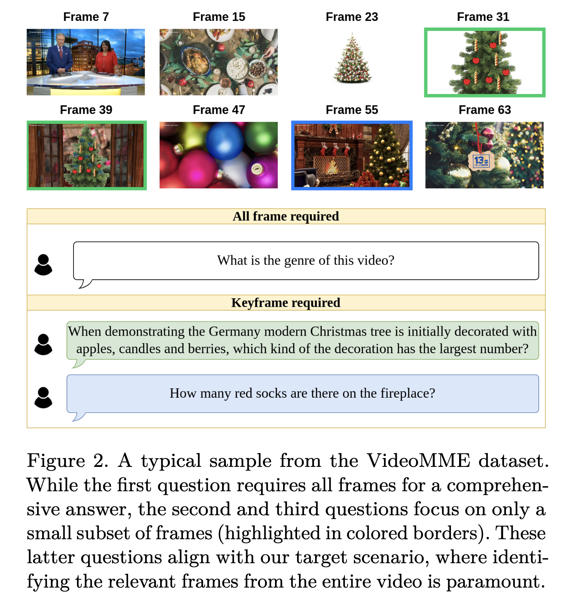

- [[papers/2025-moma-qa-fine-grained-video-question-answering|Towards Fine-Grained Video Question Answering (MOMA-QA / SGVLM)]] — Stanford; introduces MOMA-QA benchmark (300K QA pairs with temporal + bounding box annotations) and SGVLM integrating scene graph predictor + frame localizer for fine-grained multi-actor VideoQA
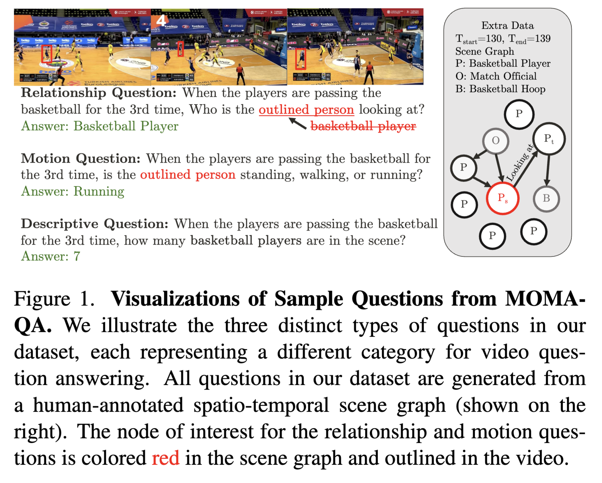

- [[papers/2025-re-thinking-temporal-search-long-form-video|Re-thinking Temporal Search for Long-Form Video Understanding]] — CVPR; introduces LV-HAYSTACK dataset (480h, 15,092 instances) revealing SOTA gap (2.1% temporal F1); proposes T* framework reframing temporal search as spatial search; improves GPT-4o 50.5%→53.1%, LLaVA-OV-72B 56.5%→62.4% with 32 frames (3x FLOPs efficiency)
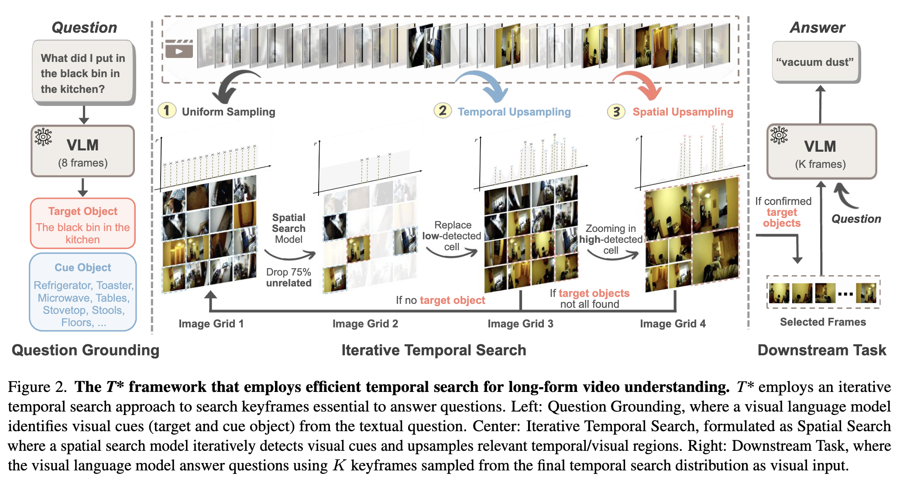

- [[papers/2025-timesearch-r-temporal-search-video-understanding|TimeSearch-R: Adaptive Temporal Search for Long-Form Video Understanding]] — RL-trained (GRPO-CSV) model that interleaves textual reasoning with dynamic frame retrieval for long-form video QA; SOTA on Haystack-LVBench, Haystack-Ego4D, VideoMME, LongVideoBench
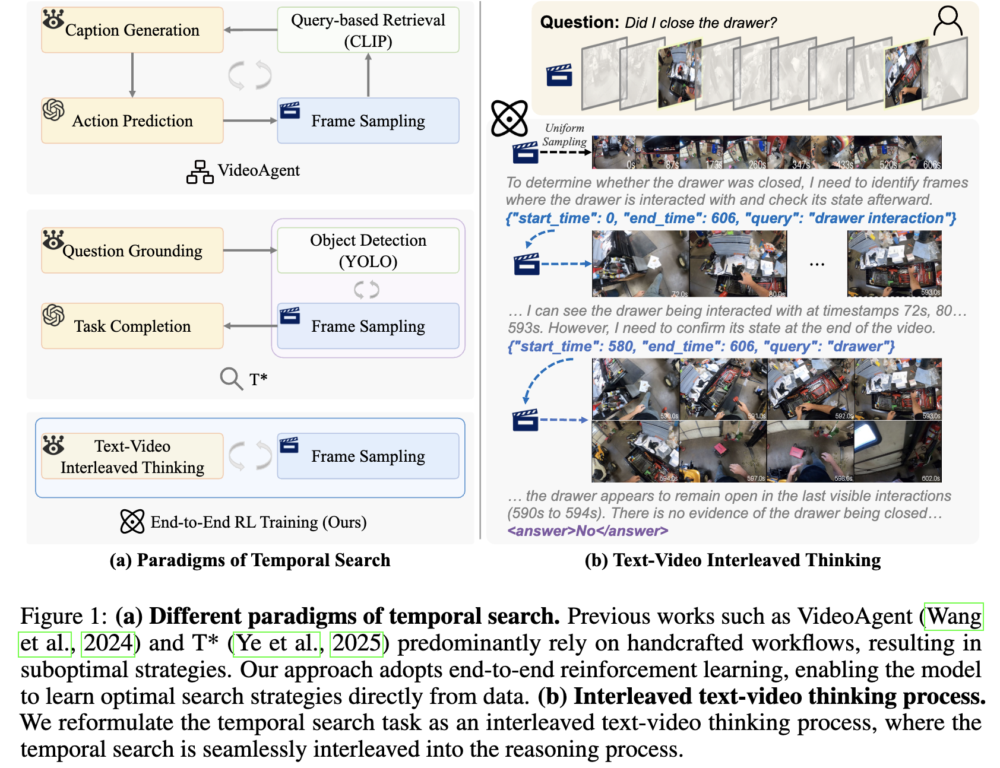

- [[papers/2025-urbanvideo-bench|UrbanVideo-Bench: Benchmarking Vision-Language Models on Embodied Intelligence with Video Data in Urban Spaces]] — ACL; 1.5k real + simulated urban drone videos with 5.2k QA testing 17 Video-LLMs on embodied cognition (scene perception, goal detection, spatial reasoning, navigation); reveals gaps in counterfactual reasoning and Sim-to-Real transfer potential
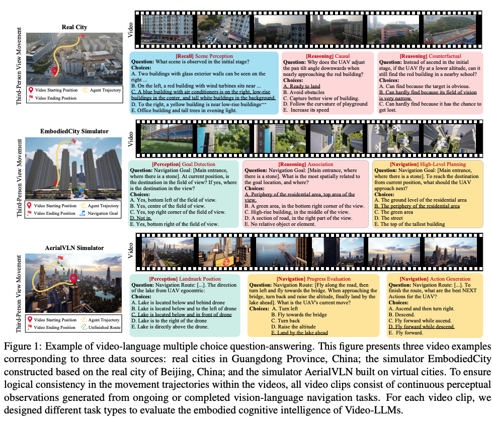

- [[papers/2025-internvideo2.5|InternVideo2.5: Empowering Video MLLMs with Long and Rich Context Modeling]] — arXiv; hierarchical token compression (HiCo) + task preference optimization (TPO) enables 6x longer video memory with fine-grained understanding; SOTA on MVBench/VideoMME; emergent object tracking and segmentation capabilities
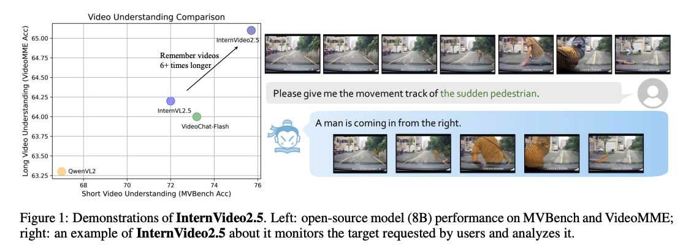

## Concepts

- [[concepts/embodied-cognition-in-video|Embodied Cognition in Video]] — first-person spatial reasoning and navigation in 3D environments; egocentric perception, goal detection, spatial reasoning, and counterfactual understanding; aerial vs. ground-level, real vs. simulated
- [[concepts/temporal-search|Temporal Search]] — query-dependent iterative frame selection for long videos; static vs. agent-based vs. RL-trained approaches; DPP-based selection; emergent search patterns
- [[concepts/vision-token-pruning|Vision Token Pruning]] — reducing LLM computational overhead by selectively removing/merging visual tokens; magnitude-based, similarity-based, and query-aware variants; frame-level vs. token-level granularity
- [[concepts/query-aware-frame-selection|Query-Aware Frame Selection]] — selecting important frames relative to a specific query rather than by intrinsic visual properties; enables task-specific efficiency; variants include hard selection, soft pruning, RL-based, and agent-guided search
- [[concepts/grpo-for-multimodal-reasoning|GRPO for Multimodal Reasoning]] — Group Relative Policy Optimization for video/multimodal RL; GRPO-CSV variant with completeness self-verification reward
- [[concepts/scene-graph-for-video-qa|Scene Graphs for Video QA]] — explicit spatial/relational structure from object detection integrated into video-language pipelines; critical for multi-actor relationship reasoning
- [[concepts/data-composition-for-video|Data Composition for Video]] — splicing and arrangement strategies for video-text pairs to expand temporal diversity during training; random, visually clustered, and semantically clustered composition

## See also

- [[../vision-language-models/index|Vision-Language Models]] — DAM uses video captioning; shared encoder-projector-LLM architecture patterns
