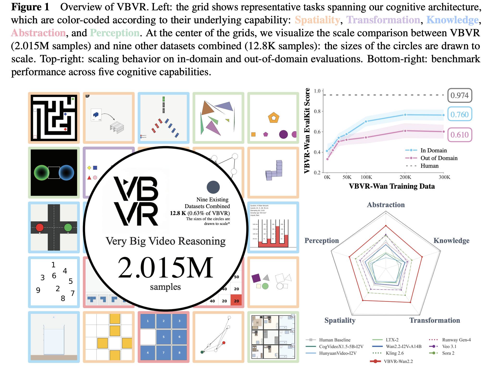
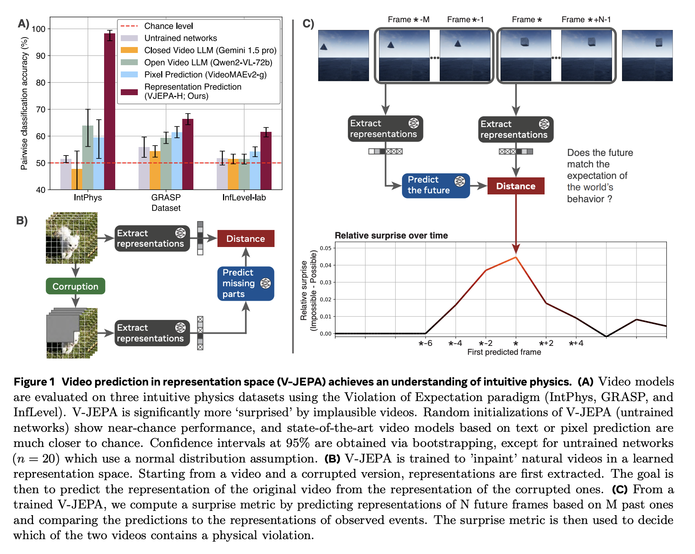

# World Models — Index

Research on learning and representing models of visual environments—the dynamics, physics, and structure of the world. Covers self-supervised representation learning from video, physical reasoning, visual prediction, emergent reasoning from learned representations, and systematic evaluation of world reasoning capabilities.

## Papers by year

### 2026
- [[papers/2026-vbvr-very-big-video-reasoning|VBVR: A Very Big Video Reasoning Suite]] — 2.015M-sample dataset across 200 tasks spanning five cognitive capabilities (Spatiality, Transformation, Knowledge, Abstraction, Perception); verifiable eval framework; first large-scale scaling study showing emergent generalization

### 2025
- [[papers/2025-intuitive-physics-self-supervised-pretraining|Intuitive physics understanding emerges from self-supervised pretraining on natural videos]] — V-JEPA learns intuitive physics (object permanence, shape consistency, contact) via masked video inpainting in representation space; achieves 96% accuracy on physics violation tasks without explicit supervision

## Concepts

- [[concepts/cognitive-architecture|Cognitive Architecture]] — foundational faculties of reasoning: Abstraction, Knowledge, Spatiality, Perception, Transformation; grounded in cognitive science theory
- [[concepts/joint-embedding-predictive-architecture|Joint Embedding Predictive Architecture (JEPA)]] — learns abstract representations by predicting missing parts of sensory input in representation space (not pixels); enables efficient, interpretable world modeling
- [[concepts/violation-of-expectation|Violation of Expectation]] — developmental psychology framework: measure surprise (prediction error) as proxy for detecting implausible events; enables zero-shot physics understanding probing
- [[concepts/predictive-coding|Predictive Coding]] — neuroscience-grounded hypothesis that learning is driven by minimizing prediction error; brain maintains internal models that predict sensory input and update on mismatches
- [[concepts/intuitive-physics|Intuitive Physics]] — commonsense understanding of physical laws (object permanence, solidity, continuity, contact); foundational cognitive capability across humans and animals
- [[concepts/verifiable-evaluation|Verifiable Evaluation]] — rule-based, human-aligned scoring for reproducible and interpretable diagnosis of reasoning capabilities; alternative to VLM-as-judge paradigms

## See also

- [[../video-understanding/index|Video Understanding]] — related: covers video comprehension and visual reasoning, but less focus on physics, dynamics, or structured world modeling
- [[../3d-scene-understanding/index|3D Scene Understanding]] — related: spatial reasoning and scene structure, but primarily geometry/layout; world-models emphasizes dynamics, physics, and emerging reasoning capabilities
